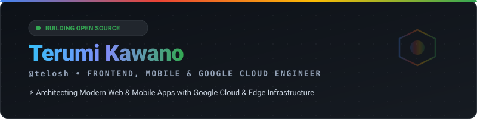
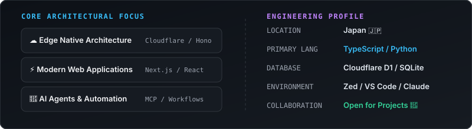
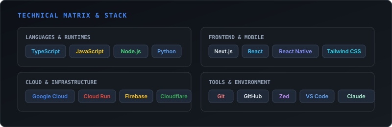

<div align="center">
  <!-- Header SVG -->
  
</div>

<br/>

<!-- Profile & Focus -->
<div align="center">
  
</div>

<br/>

<!-- Tech Matrix -->
<div align="center">
  
</div>

<br/>

<!-- Terminal / Info Block -->
```text
┌─────────────────────────────────────────────────────────────────────────────┐
│ $ telosh --info                                                             │
├─────────────────────────────────────────────────────────────────────────────┤
│ > Primary Focus: Frontend & Mobile Native (Next.js / React Native)          │
│ > Cloud Platform: Google Cloud (GCP, Cloud Run, Firebase) & Cloudflare      │
│ > Current Stack: TypeScript, React Native, Next.js, Hono, Python            │
│ > Exploration: AI Agent Tooling (MCP), Automated Workflows                  │
│ > Location: Japan 🇯🇵                                                        │
└─────────────────────────────────────────────────────────────────────────────┘
```

<br/>

<!-- Quote Footer -->
<div align="center">
  <p><sub><i>"If you don't like where you are, change it. You're not a tree." — Jim Rohn</i></sub></p>
</div>