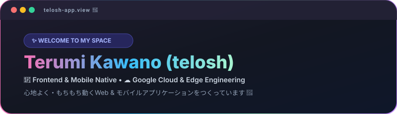
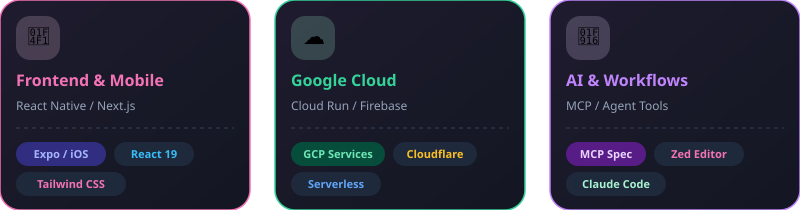
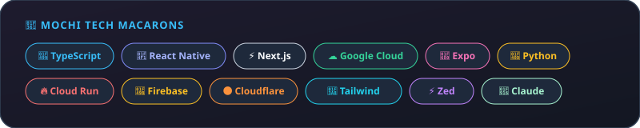

  <!-- Header -->
  

 

<!-- Feature Cards -->

  

 

<!-- Tech Stack -->

  

 

<!-- Dashboard Table -->

| CATEGORY | TECH &amp; TOOLS |
|---|---|
| **Frontend &amp; Mobile** | `React Native` `Expo` `Next.js` `React 19` `Tailwind CSS` |
| **Cloud Platform** | `Google Cloud (GCP)` `Cloud Run` `Firebase` `Cloudflare Workers` |
| **Languages &amp; Core** | `TypeScript` `JavaScript` `Node.js` `Python` |
| **Developer Setup** | `Zed Editor` `VS Code` `Claude Code` `Git` `GitHub` |

 

<!-- Connect Section -->

  <h3>Connect</h3>

  
  &nbsp;&nbsp;
  

 

---

  
<i>“If you don't like where you are, change it. You're not a tree.” — Jim Rohn</i>

