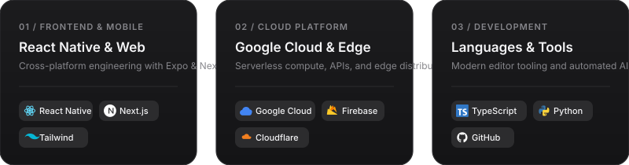

  <!-- Header Card -->
  

 

<!-- Grid Cards -->

  

 

<!-- Clean Architecture Summary Table -->

| DOMAIN | STACK &amp; INFRASTRUCTURE |
|---|---|
| **Frontend &amp; Mobile** | `React Native` `Expo` `Next.js` `React` `Tailwind CSS` |
| **Cloud Platform** | `Google Cloud (GCP)` `Cloud Run` `Firebase` `Cloudflare` |
| **Languages** | `TypeScript` `JavaScript` `Node.js` `Python` |
| **Tooling** | `Zed Editor` `VS Code` `Claude Code` `Git` `GitHub` |

 

<!-- Connect Links -->

&nbsp;&nbsp;

 

---

  
<i>“If you don't like where you are, change it. You're not a tree.” — Jim Rohn</i>

